This guide provides a step-by-step description of how to implement a [recommended continuous delivery pipeline](https://success.outsystems.com/Documentation/Development_FAQs/How_to_build_an_OutSystems_continuous_delivery_pipeline) for OutSystems applications by leveraging the [LifeTime Deployment API](https://success.outsystems.com/Documentation/11/Reference/OutSystems_APIs/LifeTime_Deployment_API_v2) along with [Azure DevOps](https://azure.microsoft.com/en-us/services/devops/).

## Azure pipelines release flow

The role of a "deployment pipeline" is to ensure that code and infrastructure are always in a deployable state, and that all code checked in to trunk can be safely deployed into production.

The goal of the **Build Pipeline** is to provide everyone in the value stream, especially developers, the fastest possible feedback if a release candidate has taken them out of a deployable state. This could be a change to the code, to any of the environments, to the automated tests, or even to the pipeline infrastructure.

The Build Pipeline also stores information about which tests were performed on which build and what the test results were. In combination with the information from the version control history, we can quickly determine what caused the deployment pipeline to break and, likely, how to fix the error.

On the other hand, the **Release Pipeline** serves as the "push-button" device mentioned before, where all the necessary actions for successfully deploying to production a release candidate that has gone through the Build Pipeline are carried out.

> **Note**
>
> Most of the workload throughout the pipeline is performed by calling a set of functions from the [outsystems-pipeline](https://pypi.org/project/outsystems-pipeline/) Python package, distributed by OutSystems on the Python Package Index (PyPI) repository.

### Build Pipeline anatomy

The Build Pipeline contains a single stage that includes **two main actions** as described in the following table:

| Actions | Tasks performed |
|-------|-------------------|
| Deploy to REG | Fetch the latest versions (tags) in DEV for the configured Applications and deploy them to REG environment. |
| Run Regression | Generate Python script for running BDD test scenarios using unittest module.  Run unit test suite and publish test results report. |

By leveraging the test-execution REST API, the pipeline is able to run tests written with the BDD Framework in the list of configured test applications. The outcome of this action is presented as a JUnit test report that seamlessly integrates with the Azure DevOps UI, as shown in the following picture:

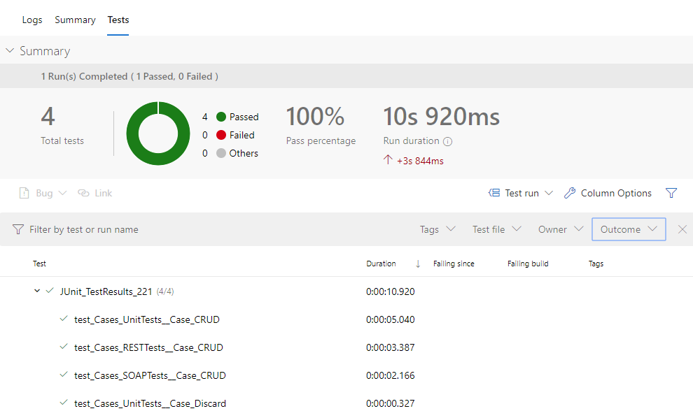

> **Note**
>
> To learn more about running tests written with the BDD Framework using the test-execution REST API, please check [this article](https://www.outsystems.com/blog/posts/automate-bddframework-testing/).

Whenever **Run Regression** fails, the ongoing pipeline run is marked as failed and all subsequents stages are skipped, thus preventing a release candidate version to proceed further down the pipeline. The pipeline test report will also display which tests failed and why, for easier troubleshooting of the regression error. 

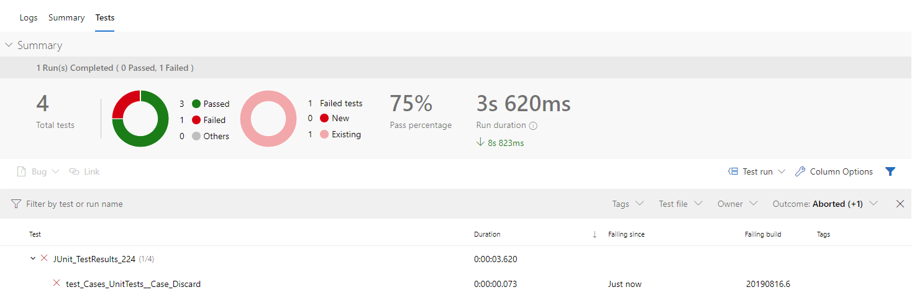

### Release Pipeline anatomy

The release pipeline is comprised of **3 sequential stages**, each one performing one or more actions as described in the following table:

| Stage | Actions performed |
|-------|-------------------|
| Deploy to ACC | Deploy the latest versions (tags) for the configured Applications (excluding test apps) from REG to ACC environment.  Wait for input from an authorized user to accept changes and proceed until production. |
| Deploy Dry-Run | Deploy the latest versions (tags) for the configured Applications from ACC to PRE environment. |
| Deploy Production | If the dry-run is successful, immediately trigger the deployment to PRD of the latest versions (tags) for the configured Applications. |

Whenever the pipeline reaches **Accept Changes** after the successful deploy on ACC, Azure Pipelines halts the pipeline execution until an authorized user makes the decision to accept (or reject) the release candidate version and proceed until production without further human intervention.

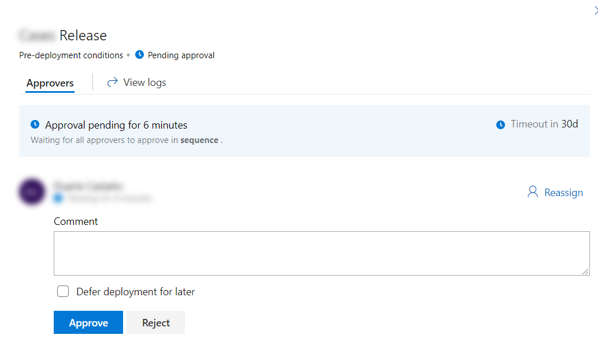

## Prerequisites

Please confirm that you have the following prerequisites before following the steps described in this guide:

* Make sure you have the [necessary rights to configure pipelines](https://docs.microsoft.com/en-us/azure/devops/pipelines/policies/set-permissions?view=azure-devops) in your Azure DevOps project.

* Have at least one [Azure Pipelines self-hosted agent](https://docs.microsoft.com/en-us/azure/devops/pipelines/agents/agents?view=azure-devops#install) registered in the default agent pool with:
  * Python 3 installed

    Make sure that you also install the `pip` package installer. 
    On Windows systems, also make sure to activate the option "Add Python to PATH" in the installation wizard.

  * Access to PyPI.org

  * HTTPS connectivity with LifeTime

  * HTTPS connectivity with the front-end servers that are going to run test suites

## Step-by-step configuration guide

### 1. Publish CI/CD probe in Regression environment

To retrieve environment-specific information that is required when running the continuous delivery pipeline, the [CI/CD Probe](https://www.outsystems.com/forge/component-overview/6528/ci-cd-probe) Forge component must be installed on the Regression environment of your deployment pipeline.

To install the CI/CD probe, download the [CI/CD Probe matching your Platform Server version](https://www.outsystems.com/forge/component-versions/6528) and publish it on the Regression environment using Service Center. Alternatively, you can install the component directly from the Service Studio interface.

> **Note**
>
> For the time being, the CI/CD Probe is only used for discovering the endpoints of existing BDD test scenarios in the target environment. Additional functionality may be added to the CI/CD Probe in future iterations.

### 2. Set up variables

In Azure, **variable groups** are a convenient way to to make sets of reusable variables available across multiple pipelines.

In this guide we'll create and use a single variable group that will provide all infrastructure context to run the pipelines.

#### 2.1. Create a variable group

From the Azure Pipelines Dashboard, open the "Library" tab to see a list of existing variable groups for your project and choose "+ Variable group".

Enter a name and description for the variable group and make it accessible to any pipeline by setting the option "Allow access to all pipelines".

#### 2.2. Register LifeTime authentication token as secret variable

You need to [create a LifeTime service account and generate an authentication token](https://success.outsystems.com/Documentation/11/Reference/OutSystems_APIs/LifeTime_Deployment_API_v2/REST_API_Authentication) to authenticate all requests to the Deployment API.

From the variable group previously created, select "+ Add" and provide the following configuration values:

* **Name:** LifeTimeServiceAccountToken
* **Value:** &lt;your LifeTime authentication token&gt;

Click on the "lock" icon at the end of the row to encrypt and securely store the value. (The values of secret variables are stored securely on the server and cannot be viewed by users after they are saved. After being encrypted the values can only be replaced.)

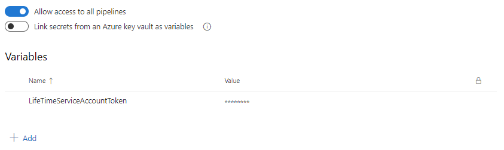

#### 2.3. Register environment variables

For a smooth run of the pipeline you'll need to provide some context about your OutSystems factory and global values to be used by the pipelines.

From the variable group previously created, select "+ Add" and provide the following configuration values:

| Name | Value | Example value |
|------|-------|---------------|
| LifeTimeHostname | &lt;Hostname of LifeTime environment&gt; | lifetime.example.com |
| LifeTimeAPIVersion | &lt;Version of LifeTime Deployment API to use&gt; | 2 |
| DevelopmentEnvironment | &lt;Name of Development environment as defined on LifeTime&gt; | Development |
| RegressionEnvironment | &lt;Name of Regression environment as defined on LifeTime&gt; | Regression |
| AcceptanceEnvironment | &lt;Name of Acceptance environment as defined on LifeTime&gt; | Acceptance |
| PreProductionEnvironment | &lt;Name of Pre-Production environment as defined on LifeTime&gt; | Pre-Production |
| ProductionEnvironment | &lt;Name of Production environment as defined on LifeTime&gt; | Production |
| ProbeEnvironmentURL | &lt;URL of environment where CI/CD probe is deployed&gt; | https://regression-env.example.com/ |
| BddEnvironmentURL | &lt;URL of environment where BDD tests will run automatically&gt; | https://regression-env.example.com/ |
| ArtifactsBuildFolder | &lt;Folder that will store all outputs from the Build pipeline to be used by the Release pipeline&gt; | Artifacts |
| ArtifactName | &lt;Name specification for the compressed outputs to be used by the Release pipeline&gt; | manifest |
| ArtifactsReleaseFolder | &lt;Folder that will store the outputs from the Build pipeline&gt; | $(System.DefaultWorkingDirectory) |
| OSPipelineVersion | &lt;Outsystems Python package version&gt; | 0.2.18 |

### 3. Create Build and Release Pipelines

To orchestrate the flow of activities for the continuous delivery pipeline, as described in the introduction, you'll need to create two pipelines: Build and Release Pipelines.

#### 3.1. Create a Build Pipeline using template definition file

The easiest way to do this is by providing a YAML file containing the build pipeline definition. A template YAML file for the OutSystems continuous delivery pipeline [is provided here](https://github.com/OutSystems/outsystems-pipeline/tree/master/examples/azure_devops).

It is highly advisable to store your template YAML file using a version control system such as Git, as this ensures that you are able to keep track of any changes made to your pipeline definition going forward. Additionally, any other supporting artifacts that you may need to run your continuous delivery pipeline can also be stored in a single location alongside the YAML file, and synced to the pipeline workspace folder on every run.

##### 3.1.1. Create Build Pipeline

From the Azure Pipeline Dashboard, navigate to the **Pipelines** tab, under **Builds** page, select **+ New**, **New build pipeline**, choose "Use the classic editor to create a pipeline without YAML", then select the version control system (Source) where you've previously stored the YAML file.

> **Note**
>
> We have chosen the classic editor to have a streamlined configuration. It's also possible to configure by selecting the "Existing Azure Pipelines YAML file" option but you will have to cancel the pipeline execution immediately after you save it since it will attempt to run it immediately.

Once you have configured the version control system, choose YAML for **Configuration as code**.

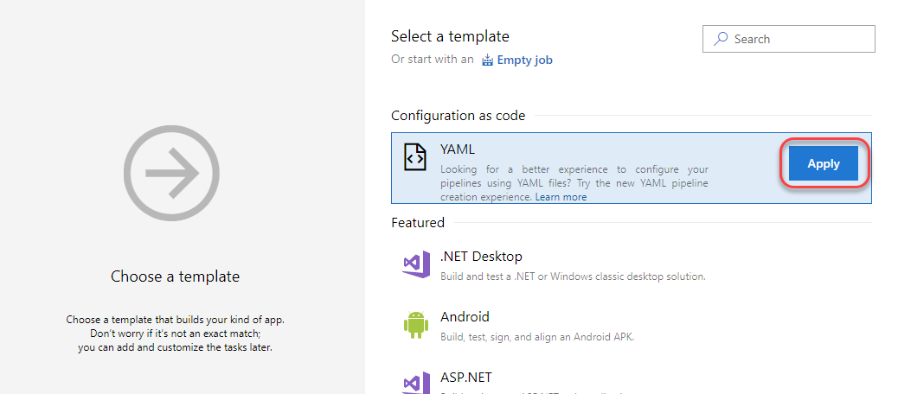

From the Pipeline tab define the name as "&lt;YourProduct&gt;-Build-Pipeline", choose the **Default Agent Pool** where the self-hosted agent is registered and select the previously stored YAML file.

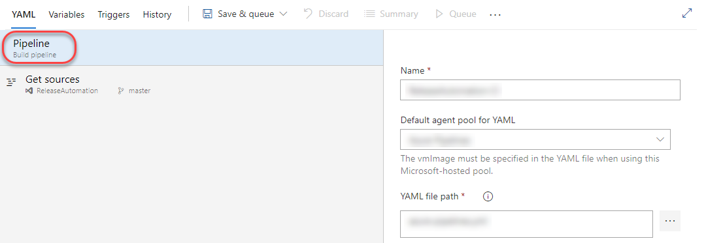

##### 3.1.2. Configure Build Pipeline variables

From the **Variables** tab, navigate to the variable groups, select the **Link variable group** button and choose the previously created variable group.

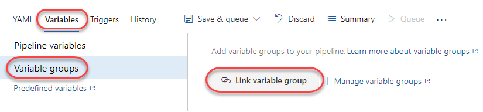

From the **Variables** tab, navigate to the **Pipeline Variables**,  select **+ Add** and provide the following configuration values:

| Name | Value | Settable at queue time |
|------|-------|------------------------|
| ApplicationScope | Leave blank, the value will be fetched from LifeTime Trigger Plugin | Yes |
| ApplicationScopeWithTests | Leave blank, the value will be fetched from LifeTime Trigger Plugin | Yes |
| TriggeredBy | Leave blank, the value will be fetched from LifeTime Trigger Plugin | Yes |

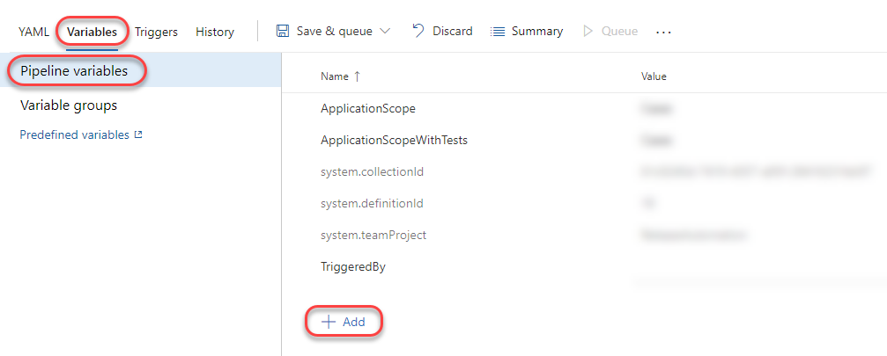

From the **Save & Queue** tab choose **Save**.

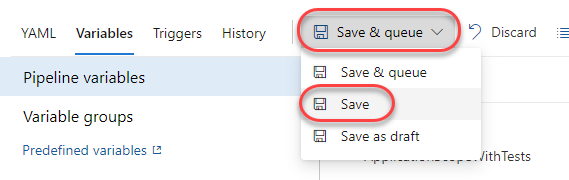

#### 3.2. Create a task group

A template JSON file for the task group [is provided here](https://github.com/OutSystems/outsystems-pipeline/tree/master/examples/azure_devops).

From the Azure Pipeline Dashboard, navigate to the **Pipelines** tab, under **Task groups** page, select **Import**, and upload the JSON template file. Then, save the newly created task group.

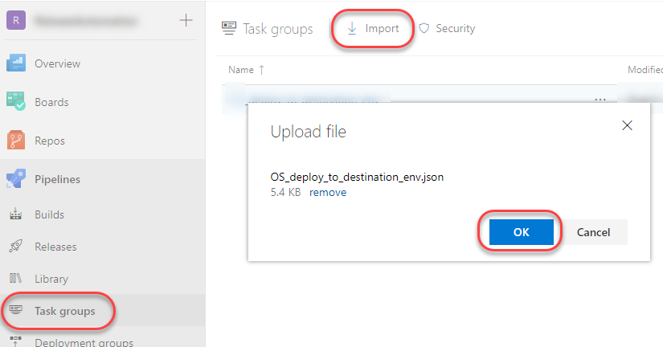

#### 3.3. Create a Release Pipeline

As Azure does not yet support pipeline as code for Release Pipelines, we have to configure it via the GUI.

From the Azure Pipeline Dashboard, navigate to the **Pipelines** tab, under **Releases** page, select **+ New**, **New release pipeline**, and choose **Empty job**.

##### 3.3.1. Get artifacts from Build Pipeline

Define the name of the Release Pipeline as "&lt;YourProduct&gt;-Release-Pipeline" and select **+ Add an artifact**.

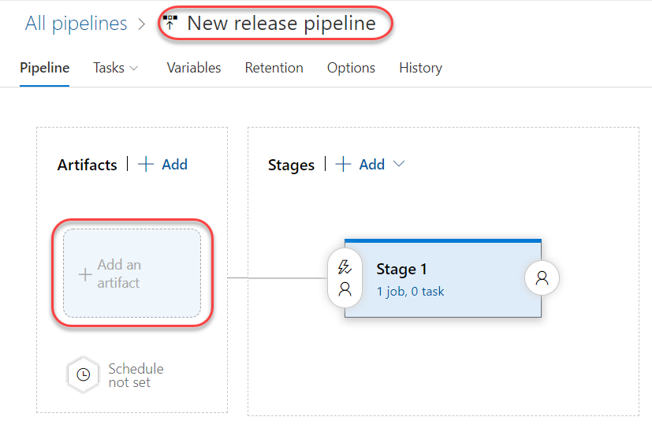

Pipeline artifacts allow sharing files between different pipelines. They are typically the output of a build process that need to be consumed by another job or be deployed. Artifacts are associated with the run that produced them and remain available after the run has been completed.

To retrieve the artifacts from the Build Pipeline, choose **Build** as the source type and fill in the fields, keeping the default value for the **Source alias**.

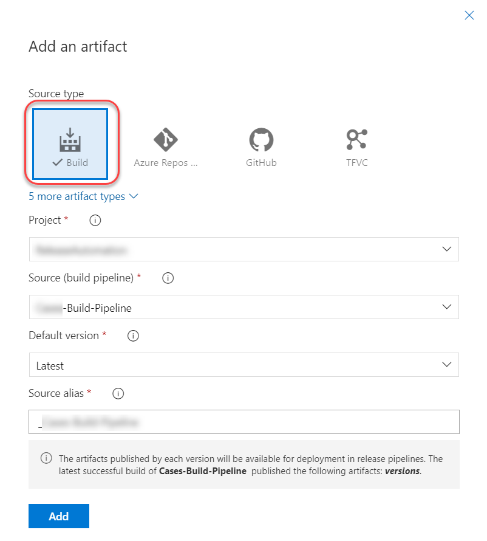

##### 3.3.2. Configure Continuous Deployment  trigger

To automatically trigger the Release Pipeline after a successful Build Pipeline run, select and enable the **Continuous deployment trigger**.

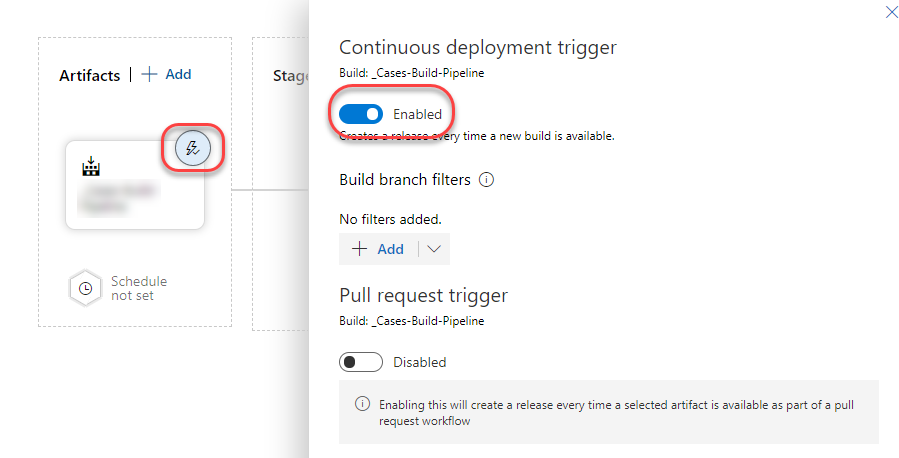

##### 3.3.3. Configure Pipeline Variables

From the **Variables** tab, navigate to **Variable groups**, select **Link variable group** and choose the previously created variable group.

From the **Variables** tab, navigate to the **Pipeline Variables**, select **+ Add**, and provide the following configuration values:

| Name | Value | Settable at release time |
|------|-------|--------------------------|
| ApplicationScope | Leave blank, the value will be fetched during the Pipeline execution | Yes |

#### 3.3.4. Configure Release Pipeline stages

##### 3.3.4.1. Configure Release Pipeline agent pool and artifact

From the **Tasks** tab, name the stage to "&lt;YourProduct&gt;-&lt;Stage&gt;", select **Agent Job**, define the **Display name** and **Agent pool**, and make sure the job gets the artifact resulting from the Build Pipeline.

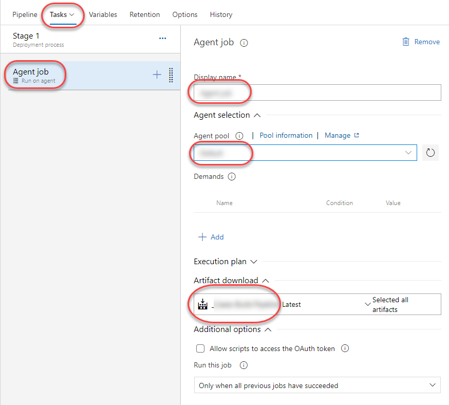

##### 3.3.4.2. Configure Release Pipeline tasks

Within the stage, select **+** to add a task, search for the previously created task group and click the **Add** button.

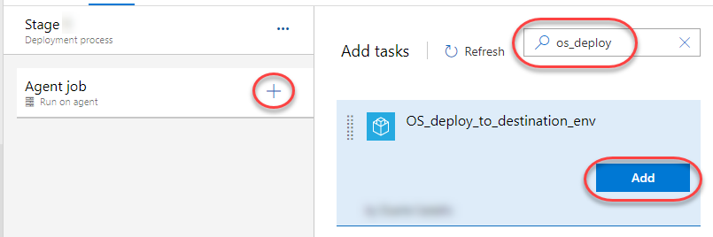

Fill in the following mandatory parameters:

| Parameter | Value |
|-----------|-------|
| ArtifactName | `$(ArtifactName)` |
| ArtifactsReleaseFolder | `$(ArtifactsReleaseFolder)` |
| DestinationEnvironment | `$(AcceptanceEnvironment)` |
| LifeTimeAPIVersion | `$(LifeTimeAPIVersion)` |
| LifeTimeHostname | `$(LifeTimeHostname)` |
| LifeTimeServiceAccountToken | `$(LifeTimeServiceAccountToken)` |
| OSPipelineVersion | `$(OSPipelineVersion)` |
| SourceEnvironment | `$(RegressionEnvironment)` |

##### 3.3.4.3. Clone and configure stages

Open the **+ Add** drop-down list and choose **Clone stage**. The clone option is available only when an existing stage is selected.

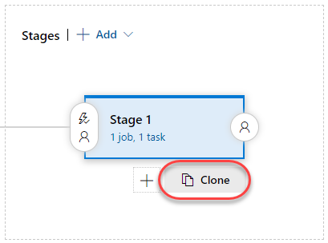

Repeat the same clone action from the recently cloned stage, so that you get a sequence of three stages as shown below:

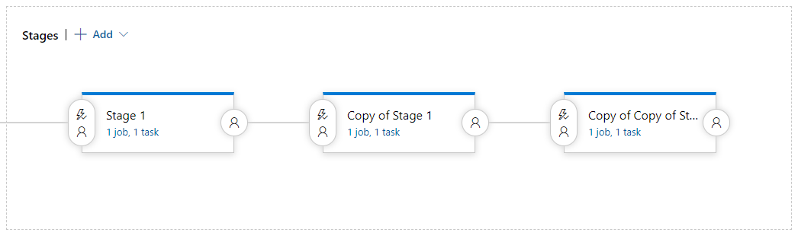

Set the specific parameters for each stage:

| Parameter | Stage 1 | Stage 2 | Stage 3 |
|-----------|---------|---------|---------|
| DisplayName | `Acceptance` | `Pre-Production` | `Production` |
| DestinationEnvironment | `$(AcceptanceEnvironment)` | `$(PreProductionEnvironment)` | `$(ProductionEnvironment)` |
| SourceEnvironment | `$(RegressionEnvironment)` | `$(AcceptanceEnvironment)` | `$(PreProductionEnvironment)` |

#### 3.3.5. Define Deployment Approval

You may want to have an approval gate to take control over the start and completion of the deployments in a release.  With approvals, you can force a Release Pipeline to halt and wait for a set of authorized users to manually approve or reject deployments.

Select Post-deployment conditions from the first stage.

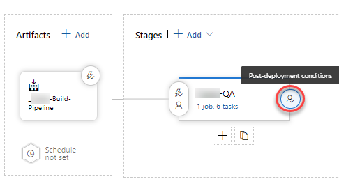

Enable Post-deployment approvals and add the users responsible for approving the release candidate to be deployed into Pre-Production and Production Environments.

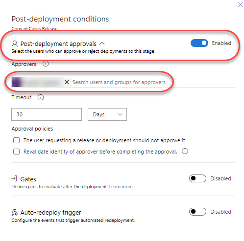

After this, save the Release Pipeline.

### 4. Trigger pipeline execution remotely

Triggering subsequent pipeline runs can be made directly from the Azure DevOps UI, as needed. This approach, however, is not desirable as it would require provisioning an Azure user account for each person that is allowed to trigger the pipeline - in the worst case scenario, an Azure account per developer.

On the other hand, the purpose of the deployment pipeline is to reduce the amount of manual work required throughout the pipeline’s flow of activities.

To address this issue, the [Trigger Pipeline](https://www.outsystems.com/forge/component-overview/5670/trigger-pipeline) LifeTime plugin available on the OutSystems Forge automatically detects when new versions (tags) are available for a configured subset of LifeTime applications and triggers an associated Azure DevOps pipeline by leveraging the Azure DevOps REST API.

To install the Trigger Pipeline plugin, download the [Trigger Pipeline plugin matching your Platform Server version](https://www.outsystems.com/forge/component-versions/5670) and publish it to your LifeTime environment using Service Center. Alternatively, you can install the component directly from the Service Studio interface.

After the plugin is successfully published in the LifeTime environment, select **Configure Triggers** from the plugin landing page in LifeTime and configure the following parameters:

* **Source Environment:** _&lt;Select your OutSystems Development environment&gt;_
* **Pipeline Server Type:** _Azure DevOps_
* **Pipeline Server Address:** _&lt;Your Azure Pipeline instance address (including Project)&gt;_
* **Pipeline Server Credentials:** _&lt;Credentials of an Azure user account with enough permissions for running pipeline jobs&gt;_

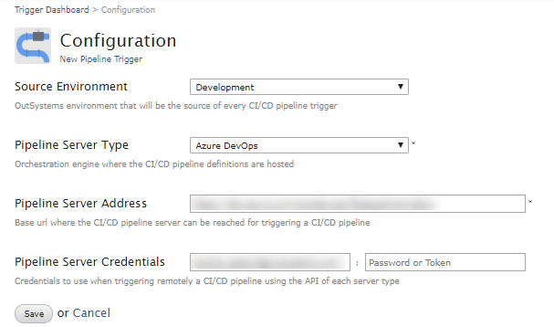

One or more pipeline triggers can be configured by providing the following data:

* **Pipeline:** _&lt;Unique name that identifies the pipeline in Azure DevOps&gt;_
* **Applications:** _&lt;List of LifeTime applications that will trigger the CI/CD pipeline, identifying which ones are Test applications&gt;_

After the Trigger Pipeline plugin is properly configured, the dashboard screen will show the list of pipeline triggers, along with the current versions in Development of the LifeTime applications defined for each pipeline scope.  

Once there are new application versions available for triggering a pipeline, a button is shown that allows running the pipeline on-demand without the need to log in to Azure.

Alternatively, pipelines can be triggered automatically through the **CheckNewVersionsForPipeline** timer that periodically checks if there are new application versions in Development within the scope of each configured pipeline.

To enable this timer, go to the Service Center console of your LifeTime environment and configure a desirable schedule. The minimum configurable interval is 5 minutes.

> **Note**
>
> A pipeline cannot be triggered while there are still **pending** changes (within the pipeline scope) that have not yet been tagged in LifeTime. The reason for this is to avoid running the pipeline while the changeset is still open and the commit stage has not yet been finalized.
