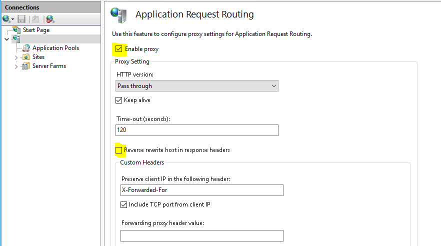
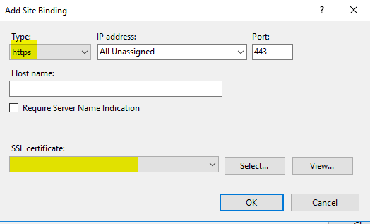
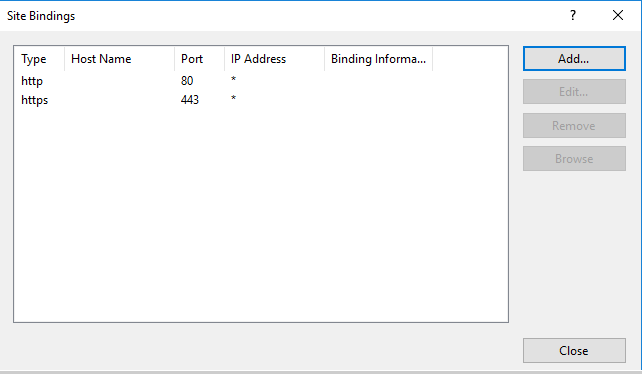
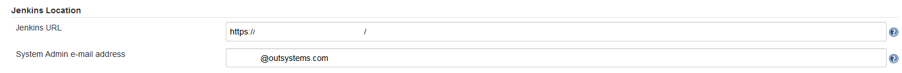
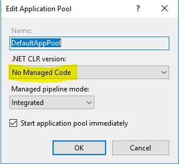
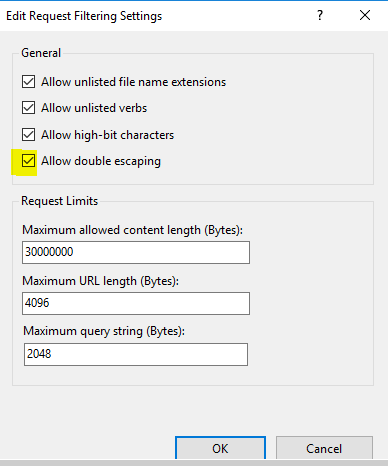
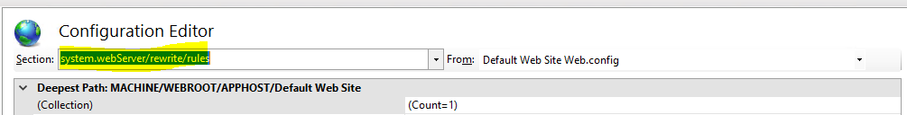

# How to install Jenkins

## Introduction

The following guide provides a step-by-step description of how to do a basic install of Jenkins in order to use it as an automation server.

Please refer to the [official documentation](https://jenkins.io/doc/book/installing/) to familiarize yourself with Jenkins and the installation process, if you want more in-depth knowledge.

## General architecture

## System requirements

This are the following system requirements we used internally to run our Jenkins server. You can adapt it to your environment to match the number of deployments you intend to run.

### Operating Systems

- Windows Server 2016
- \<TODO> Linux

### Virtual Machine

- **CPU:** 4 vCPU
- **Memory:** 16 GB
- **Disk:**
  - *Root disk:* 50 GB
  - *Data disk:* 100 GB

### AWS

- **Instance Type:** t2.xlarge
- **Disk:**
  - *Root disk:* 50 GB
  - *Data disk:* 100 GB

### Azure

- **Instance Type:** Standard_D4_v3
- **Disk:**
  - *Root disk:* 100 GB
  - *Data disk:* 100 GB

## Networking

You need to open communication on the following ports / hosts:

- Jenkins -> LifeTime (HTTP, port 80) [only needed if you don't use HTTPS]
- Jenkins -> LifeTime (HTTPS, port 443)
- Your network -> Jenkins (HTTP / HTTPS, port 80, 443)

## Jenkins installation

Download Jenkins [here](https://jenkins.io/download/). We use LTS versions of Jenkins, to provide a more stable environment. Version used was Jenkins 2.x.

### Windows

Run the installer and follow the instructions. Use the Data disk as target for the installation.

### Linux

\<TODO>

## Jenkins configuration

### Reverse proxy and HTTPS

The configuration for the proxy was adapted from [here](https://wiki.jenkins.io/display/JENKINS/Running+Jenkins+behind+IIS).

This step is optional. If you want to have Jenkins being accessible through HTTPS, you'll need to configure a reverse proxy with a certificate. The certificate generation for the hostname is left to you. Next we will describe how to install the reverse proxy on the Jenkins machine.

#### Windows - IIS

##### Requirements

- IIS 7.0 or greater
  - IIS 8.5 or greater if you want [Certificate Rebind](https://docs.microsoft.com/en-us/iis/get-started/whats-new-in-iis-85/certificate-rebind-in-iis85)
- [URL Rewrite 2.1](https://www.iis.net/downloads/microsoft/url-rewrite) or greater
  - As the [article](https://blogs.iis.net/iisteam/url-rewrite-v2-1) explains, it introduces a feature flag to turn off the default non-compliant-RFC3986 behavior. Which is what we want.
- [Application Request Routing](https://www.iis.net/downloads/microsoft/application-request-routing) 3.0 or greater

Install IIS role on the server, adding the HTTP Redirection *(Under Common HTTP Features)* and WebSocket Protocol *(Under Application Development)*

Install URL Rewrite and Application Request Routing. You should have downloaded earlier.

In the Internet Information Services (IIS) Manager, click on the *\<hostname>* server. Go to **Application Request Routing Cache** and, in the Actions panel, click on **Server Proxy Settings...**. Enable the proxy and disable the reverse rewrite host in the response header. Apply the configs.

Configure the SSL Bindings by going to *\<hostname>* server, click Sites and select **Default Web Site**. On the Actions panel, under Edit Site, click on **Bindings...**. Add the HTTPS port with the certificate you previously installed.

Click ok. You should see both HTTP and HTTPS bindings:

Open the Jenkins configuration page (<http://jenkins-hostname/configure>) and change the Jenkins URL to <https://jenkins-hostname/> if you didn't do it during the installation.

Go to **Configure Global Security** and enable **Enable proxy compatibility** if you have already enabled **Prevent Cross Site Request Forgery exploits**.

Go to Manage (<https://jenkins-hostname/manage>) and you'll see a banner **"It appears that your reverse proxy set up is broken."** as expected.

On IIS Manager, go to **Application Pools** then edit **DefaultAppPool** so that the .NET CLR version is **No Managed Code** (Right-click, select **Basic Setttings...** and change it):

Go to Sites, Default Web Site, Request Filtering. In the Actions panel choose **Edit Feature Settings...** and turn on **Allow double escaping**:

Go to Sites, Default Web Site, Configuration Editor and change the Section to **system.webServer/rewrite/rules**:

Change **useOriginalURLEncoding** to *False* (if you don't see it, you forgot to install URL Rewrite 2.1):

And that should be it. You can now use the https to access Jenkins.

#### Linux - TODO

### Plugins & Extra software

To install plugins, just type the name on the **Available Plugins**, under **Manage Jenkins** > **Manage Plugins**

#### Jenkins standard plugins

- BlueOcean: <https://wiki.jenkins.io/display/JENKINS/Blue+Ocean+Plugin>
- Build Authorization Token Root: <https://wiki.jenkins.io/display/JENKINS/Build+Token+Root+Plugin>
- JUnit: <https://wiki.jenkins.io/display/JENKINS/JUnit+Plugin>
- Pyenv Pipeline: <https://wiki.jenkins.io/display/JENKINS/Pyenv+Pipeline+Plugin>

#### Software

- Git:
  - Windows: <https://git-scm.com/download/win>
  - Linux: should be installed by default, if not use the default package repos
- Python 3.X:
  - Windows: (tested with 3.7.1) <https://www.python.org/downloads/release/python-371/>
  - Linux: \<TODO>
- Pip: [install guide](https://pip.pypa.io/en/stable/installing/)

Python on Windows:

- Don't forget to install it to **all users** and add it to the Windows PATH.
- Reboot the machine to reload the PATH variables.
- Test Python with CMD:
  - `python -V` should return something like `Python 3.7.1`
- If it doesn't work (and returns an error saying python command is not recognized), you'll need to add it [manually](https://geek-university.com/python/add-python-to-the-windows-path/) to the PATH and reboot the machine.

Python on Linux:

- Careful not to override the default system Python (usually is 2.X), since it will break your package manager.
- When using Python, refer to Python3 and Pip3 in your Jenkinsfile.