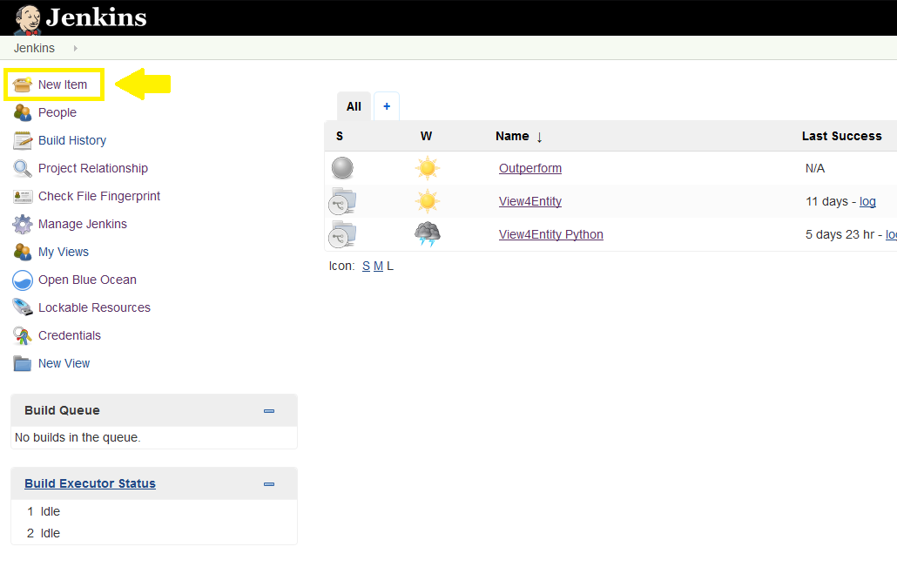
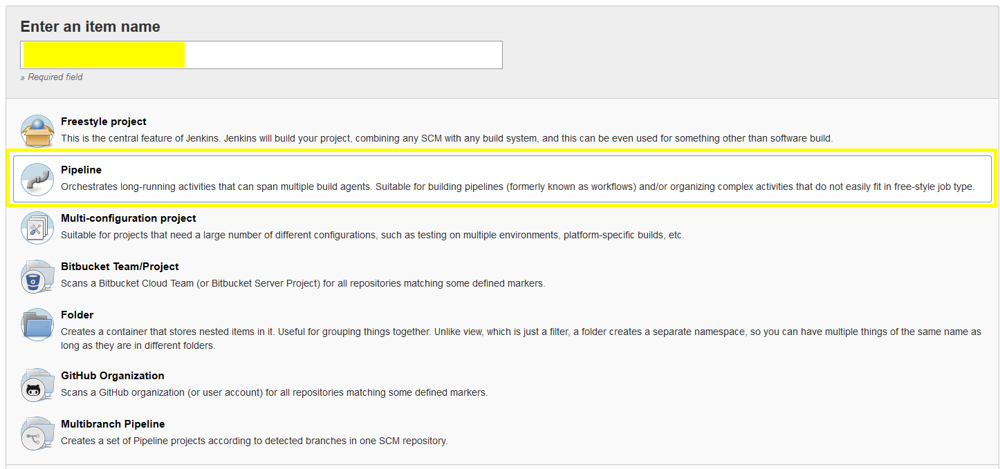
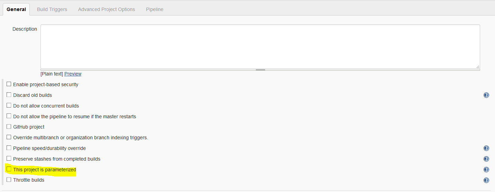
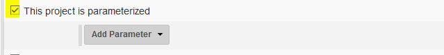
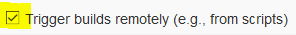
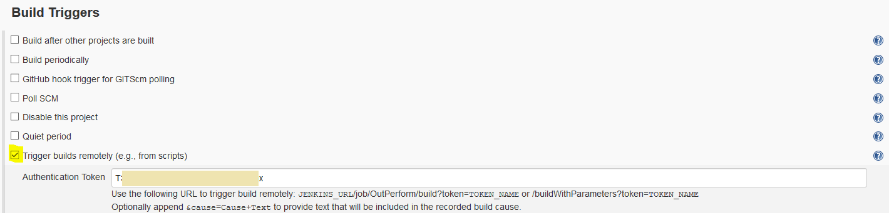

# Setting up a Jenkins pipeline

This document will go through the basics of setting up a Pipeline in Jenkins for your OutSystems applications. You're free to customize and alter it after it or extend it as you see fit.

This pipeline assumes you use 5 Environments: Development, Regression, Quality Assurance, Pre-Production and Production.

If you don't have as many environments, you can trim the parameters (and the Jenkinsfile) to suit your environment size. The major requirements are 3 environments: 1 DEV environment, 1 Regression environment, 1 Quality Assurance / Production. We recommend 5, to allow for other test cycles to be plugged to the pipeline as well.

We also chose to use parameterized builds in order to have more flexibility on the pipelines. This means we can have a single Jenkinsfile for all the pipelines but also tune it based on the parameters. It will also allow for the OutSystems LifeTime trigger plugin to trigger pipelines with LifeTime information about the apps to deploy. Although the initial setup is higher, future pipelines can be created by cloning from one existing one and changing the parameter values.

You can, of course, customize the Jenkinsfile to have hardcoded values and ignore the pipeline parameterization, creating one Jenkinsfile per pipeline and use your code repository to control Jenkinsfile's versioning and branching.

## Pre-Requirements before creating the pipeline

### Creating the Authentication Token for LifeTime

\<TODO>

### Creating GIT repository for Jenkinsfile

\<TODO>

## Creating the pipeline

Access to your Jenkins platform and, on the left menu, select **New Item**.

A window will appear. Choose a name for the pipeline. You can you other types of pipeline if you feel more confortable but since the goal here is simplicity, we will use the **Pipeline** type. Then click OK

Next, you'll see the pipeline configuration page. In the following steps we will describe the basic configuration you'll need to do to work with the base Jenkinsfile provided in the OutSystems Pipeline repository.

### Parameters

Under **General**, check the box **This project is parameterized**.

This will show a button to add the parameters:

Click on the **Add Parameter** and select the parameter type based on the following:

----------
**Name:** AppScope

**Type:** String

**Default Value:** <App name or comma separated list of apps to deploy, without the tests>

**Description:** Name of the App(s) without the tests, to deploy. If you add more than one, use a comma to separate them. Example: App1,App2 With Spaces,App3_With_Underscores

----------
**Name:** AppWithTests

**Type:** String

**Default Value:** <App name or comma separated list of apps to deploy, **with** the tests>

**Description:** Name of the App(s) with the tests, to deploy. If you add more than one, use a comma to separate them. Example: App1,App2 With Spaces,App3_With_Underscores

----------
**Name:** LTApiVersion

**Type:** String

**Default Value:** <depends on your LT OutSystems platform. If version <= 10, use 1, if version >= 11, use 2>

**Description:** LifeTime API version number. If version <= 10, use 1, if version >= 11, use 2.

----------
**Name:** LTUrl

**Type:** String

**Default Value:** \<URL for LT>

**Description:** URL for LifeTime, without the API endpoint and the trailing slash and the HTTPS protocol (https://)

----------

**Name:** LTToken

**Type:** Credentials

**Credential type:** Secret Text

**Required:** True

**Default Value:** \<You can either create here the credential for the LT Token or select on previously created>

**Description:** Token for LifeTime Access.

----------
**Name:** DevEnv

**Type:** String

**Default Value:** \<Name of the Dev Environment>

**Description:** Name of the development environment, as shown in LifeTime

----------
**Name:** RegEnv

**Type:** String

**Default Value:** \<Name of the Reg Environment>

**Description:** Name of the regression environment, as shown in LifeTime

----------
**Name:** QAEnv

**Type:** String

**Default Value:** \<Name of the QA Environment>

**Description:** Name of the quality assurance environment, as shown in LifeTime

----------
**Name:** PpEnv

**Type:** String

**Default Value:** \<Name of the PP Environment>

**Description:** Name of the pre-production environment, as shown in LifeTime

----------
**Name:** PrdEnv

**Type:** String

**Default Value:** \<Name of the PRD Environment>

**Description:** Name of the production environment, as shown in LifeTime

----------
**Name:** ProbeUrl

**Type:** String

**Default Value:** \<URL for the environment where the CICD Probe is running (e.g. Regression)>

**Description:** URL for the environment hosting the CICD Probe.

----------
**Name:** BddUrl

**Type:** String

**Default Value:** \<URL for the environment where the BDD Framework is running (e.g. Regression)>

**Description:** URL for the environment hosting the BDD Framework.

----------

### Build triggers

To allow Jenkins to be triggered by OutSystems LifeTime, you need to set a token. Go to the build trigger section and check **Trigger builds remotely (e.g., from scripts)**:

If this option does not show, make sure you have the **Build Authorization Token Root** plugin installed.

A box will appear for you to insert the token. Generate a token and paste it there.

### Source Control

Under **Pipeline**, select **Pipeline script from SCM**. Then select **GIT** as the SCM and configure the repository. Insert the .git link to your repo, where you have stored your Jenkinsfile. If you haven't setup a personal repository, now would be a good time to do it and clone the Jenkinsfile provided in the OutSystems Pipeline repository as a baseline. Since this will use the GIT procotocol, don't forget to put it as `git@<url>.git`.

As for the credentials, select the previously created GIT credentials.

Select the branch you want to use (e.g. master). Avoid using **any** or else you might have unexpected results where pipelines are using the wrong Jenkinsfile.

Finally, set up the **Script Path** with the path from the root of the repository until you read your Jenkinsfile. If the Jenkinsfile is on the root itself, just type in the name of the Jenkinsfile.

Click **Save** to finish the pipeline configuration

## Setting up the OutSystems LifeTime trigger

## Running the pipeline

## Creating other pipelines